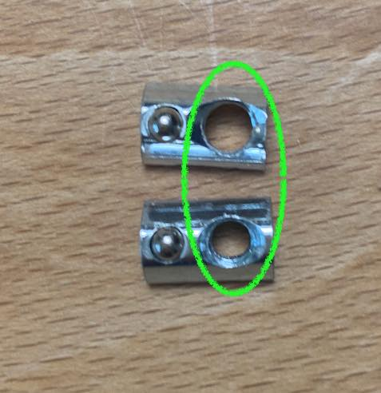
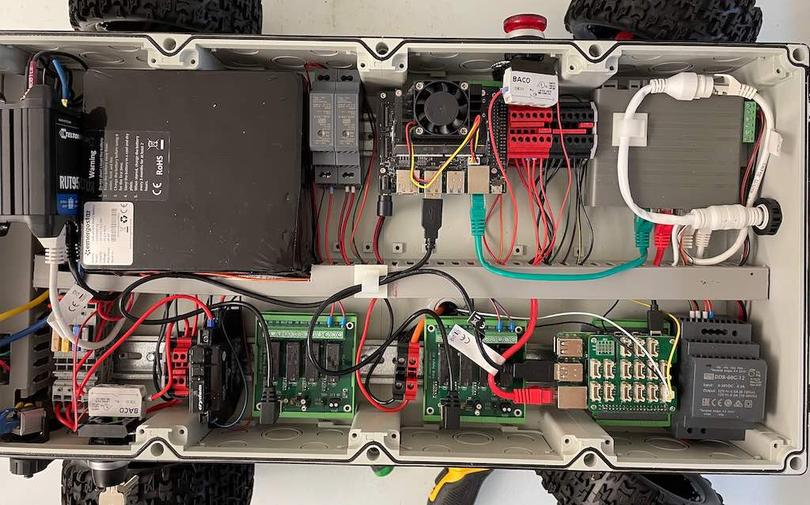
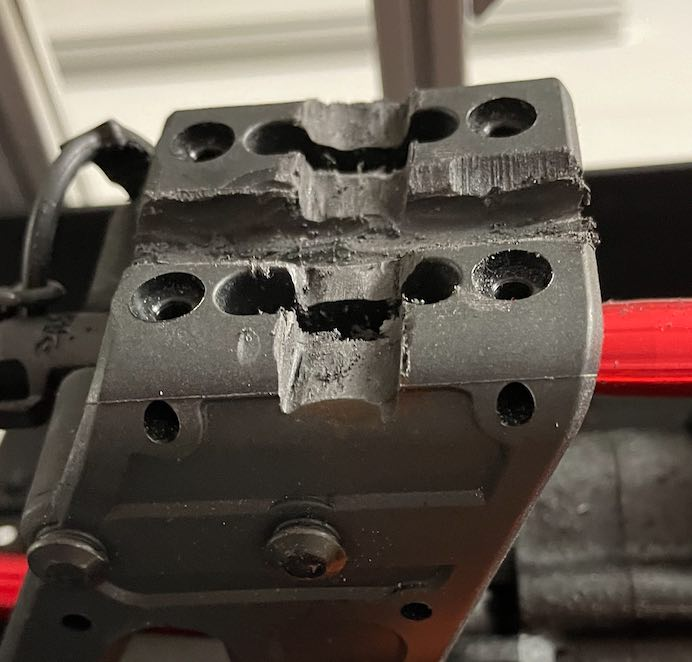

# Introduction 
#### Disclaimer 
This documentation provides information intended to help people build a self driving robot and to use it. The development of the robot is ongoing and it is not complete.  The information in the documentation is subject to change. The documentation is provided free of charge.The robot as described in the documentation is a vehicle for testing software. We do not deploy the robot for applications that carry risk of any kind. Please pay attention to the guidelines and suggestions given, also for the use and charging of the battery.  No explicit regulatory permission of any kind has been sought for deployment of the robot. This documentation has been put together with the greatest possible care. We are in no way responsible for any omissions and inaccuracies with regard to the information provided on the website, for whatever reason. We do not accept any liability.The information provided on the website are subject to certain intellectual property rights. Unless explicitly authorised to do so, you are not allowed to reproduce information provided on the website for commercial purposes of any kind.  
#### Instructions 
The instructions are exported from the development tools. The information might be a bit cryptic.  We are always in for improvements. Don't hesitate to [contact](http://www.mwlc.global/contact/) us, if you need some help or an extra picture. 
#### Content 
The robot is assembled in main stages: - Chassis - Body: External skeleton - Body: Enclosure - Cables, equipment - Enclosure lock and camera's - Configuration  
# Chassis 
#### Arrma Kraton 8S 
The  Kraton 8s is the largest Arrma model, but much too fast and with minimal carrying capacity. To be able to carry more cargo, the vehicle must be converted so that the motors for steering and driving last longer. 
Before the chassis can work for the robot we has to change some parts. - Springs - Steering servo - Tires 
After unpacking take off: - Cover Green/Orange ARA409001/7 - 2* Battery holder ARA320496 - Back spoiler, ARA480022 - Spoiler mount, ARA320492 - ARA320485 - 4* Wheels//tires ARA510122/520055/550061 - Some small parts like bolts and nuts 
#### Springs 
Change the springs First we change the springs to make it more firm and have less pressure on the shocks. Put the large springs on the place of the originals an the small around the shock shaft. Find a video with explanation. Note: The front springs are shorter than the back springs(ARA330572 and ARA330573) 
#### Esc tuning 
Change ESC settings according to  Kraton 8S instruction manual. - Low votage cut-off(variable 3) to Low(setting 1) - Brake strenght(5), 10%(7) - Reverse strength(6), 75%(3) - Punch setting(7), level 1(1) 
#### Change steering servo 
This is a tricky operation, take some time to look for the video's, with instrucitons. - Place batteries in handunit - Start the kraton and the hand unit, set the steering wheels in sytait forward - Mark position servo saver both on the saver and the casing with something sharp, screwdriver,  so you know afterwards if it fits correct. - Switch everything off - Release ESC/Servo unit, 4 screws bottom - Release cover, 6 small screws - Release reciever, and wires from the box. Take the antenner wire out of the little tube. - Release steering rod from servo saver to the steering connector on steering(watch out not to lose little nut ) -Release plastic contra bolt in servo saver. Watch out, releasing is clockwise!!! - release bolt far in servo saver to release is form the servo. Release safer with allen screw driver. - Take the new servo, connect the wire to the servo firtst. - Take the new reciever box. Check if the new servo fits. - Swap the data cable on the receiver. Of the content of the package we don’t use the spring and the steering linkage. Change the servo, take care its exactly well positoned. 
After changing the servo you can remove the receiver 
#### Wire shortcuts 
__ Red wires of the button__  Shortcut the red wires of the button Use the orange ferrule double and the heat shrink. Heatshrink 2,5mm 2:1 covering the ferrule metal tube. Heatschink 6mm, 3:1, coverin the ferrule. 
#### Cable gland bottom 
Before putting the enclosure on the robot, first put the cable gland around the cable from the ESC. - Take a M25 Cable gland  
- Multi seal, M25, 3 holes. Cut the holes open to put the cables through. - First put smal cable through one hole then the red and black from the esc each through their own holes. Then put ring from cable gland around it Asure that the shortest wire, the steering servo connector is reachabel in the enclosure. The gland must be quite tide to the chassis. Put the cable gland on it and go to the section for making the bottom hole. 
# External skeleton 
The skeleton is build with the aluminium profile. 20 x 20 mm, groove 5. 
We have two kinds, both for groove 5 but 1 kind for allan screw M5 and 1 kind for Allan screw M4 that is used for the brackets. 
 
#### Crossbeams 
Connect 2 crosbeams, 0,23m to the bottom of the chassis. Use the empty holes from the battery holders 
#### Pillars 
Attach 4 pillars, 0,14m with brackets on the low crossbeams. The bracket are under the chassis. 
#### Longitudinal beams 
On the pillars the longitudinal beams are fetched. At the right side 0,74m. At the left side 0,81m. At the front, both beams wil end just before the front camera. At the back, the right beam stops at the end of the enclosure. The left goes further to the back to mount the back camera. The longitudinal beams should be close to the bottom of the enclosure but don't push it up. The enclosure should rett on the towers of the chassis. 
#### Cross beams high 
On the longitudinal beams the high crossbeams  of 0,23m are attached. They are close to the enclosure to keep it at its place 
#### Lock pillars 
At both the front and the back side, attached to the high crossbeams, there should be a lock pillar of 0,13m. In a later stage the lock longitudinal beam wil be attached to these pillars. 
#### Mount front Camera 
Bracket 150*150mm with per side 3 holes 2  m5 10 Tripod screw 8mm 2 repairwasher m5 2 washer m5 2 Slide nut  
#### Mount back Camera 
Hinge 6  m5 10 Tripod screw schroef 6 washer m5 Slide nut Extra bracket to lock camera 
# Enclosure 
In the end the enclosure will look more or less like the picture. But we have to admit, every build we find an improvement. Less cables, less space, more easy to open. In this instructions you find our last build. Sometimes we get a request for a large battery. This takes some space. 
 
Don't forget to put in a sack of silica gel. But this can be done any time 
#### Spelsberg AKL-4-t  
The Spelsberg enclosure AKL-4-t has transparant cover, metric pre-embossings. A bit cheaper alternative enclosure has a non transparant cover. The enclosure should rest on the front and back towers of the chassis. As the center tower is just slightly lower and the bottom of the enclosure has ridges, we away some the two smalls bumps just aside of the middle cross ridge with an soldering iron. At the end we put some double adhesive tape at the towers. 
 
#### Holes, glands, conector an buttons 
See scheme voor the location and size of the holes. It might be a suggestion to keep the part that needs the hole, nearby to see if it fits. We always start with the bottom-hole and make is fit completely, even by putting the cables through the gland and see if the enclosure fits well.  
__ Bottom hole __  One of the more tricky parts is the location of the bottom hole for the M25 cable gland with the ESC power and  datacabels. The outside bottom of the enclosure has ridge wicht shoot stay intact. Check with the already attache cable gland the location 
__ Charge connector __ Avoid ths the hole gets more to the top of the enclosre. The screws to tiden theRosenberger-connector need some space.  
__ Antenna cables __  The 5 antenna cables should be at the back-side left. Bring the cables aroun 0,15m within the enclosure. - Put the close nut over the cable connetors - Take the black closing ring from the gland and put it also over the connectors. - Take the multie seal with 5 holse, cut the holes en put the cables through. First put the cable gland over the cables before putting is in het enclosure. Don't make the cable gland to tide yet. Using a multi seal, 5 holes. Take the multi seal, cut the 5 holes with scissors. Put the cabels throught the closing ring of the gland. Put the cables in the holes of the multi seal  Put around the multis seal the big single seal from the cable gland. Put the cables through the cable gland.  
__ WAN __  Put the WAN connector more to the back then the LAN connector. Use a self-adhesive cable mount, under the enclosure, to keep the cap to the vehicle wen not on the connector.  
__ LAN __ Lan connector 
__ Cable gland back Camera __  Grommet qt 6, around camera cable between camera and first split. Not to close to split. It should be possible to have the cable bend within the enclosure. Take the black contr a nut and tiden the grand to the enclosure. - Put the black 0,25m ethernet cable in the connector- Put the 1m low voltage power cable in the connector 
__ Cable gland front Camera __ Grommet around camera cable between camera and first split. Not to close to split. Is should be possible to have the cable bend within the enclosure. Cabel gland front camera works the same as back 
__ Ignition switch __ Ignition switch is at the same side as the LAN and WAN 
__ Stop button __ Stop button is ath the other side, left, of the enclosure. 
# Cables and equipment 
#### Battery and internal frame 
__ Backside cable duct __ Put a piece, 0,28m, of cable duct against the back. - Make it fitting by taking the back side corners off.  - Take 2 teeth  off by the cable cland  of the antenna's. - Take 2 and a half teeth of for the camera cable cland- take 3 tops of for the Rosenbergerconnector. 
__Battery __ Put battery at back-left side in the enclosure, against the back side cable duct 
__ Length cable duct __ Put a 0,58m cable duct in the middel over the full length of the enclosure against the right site of the battery. - Make the front 2,5 cm flat so you can put it under the stabelising front aluminum profile.  - Make the back 3 cm flat so you can put it under the back cable duct.  
#### Internal frame and equipment mount 
__ Internal frame __ The internal frame consists of a few pieces alluminium profile. A small pillar close to the battery. Connected to a horizontal piece to the front of the enclosure, that is conncted with a crossbeam to keep it stable. Make a fitting frame. 3 pieces of profile: - Pillar, from the bottom of the en closure to the cover. - Lungitudinal, from the baterry to the front side. - Crossbeam, at te front from left to right 
__ Din rail __  Put  0,53m din rail over the length of the right side of the enclosure but not on the incoming ESC cables. Put it against the backside cable duct 
Prepare din rail for mounting: - ethernet switch to crossbeam profile of internal frame, 0,05m - Computers, 0,25m - 2vdc converter, 0,10m - 2*5vc converter, 0,10m 
#### Euipment holders 
__ Relay Nano steered holder __  Use  Axxatronic 72mm: - 2 end parts - 1 narrow part - 1 widepart.  
__ Relay Pi steered holder __  See Relay Nano steered holder. 
__ Nano holder __  First, place SD card. - Take PVC plate 107 x 100mm - Take four allaen scews, 2,5x10mm - Take for lock nuts 2,5mm - Assemble Nano on the pvc plate, nuts upside,  cable connections on the nano to the left. - Put  the plate with Nano on axxatronic 107mm with foot.  
__ Pi holder __  First, place SD card. Then mount the hat on the Pi with the mounting set that comes with the Pi- Take PVC plate 108 x 80mm - Assemble Pi on the pvc plate, wiIth the distance keepersand srcews from the set delivered with the hat. - Put  the plate with Nano on axxatronic 108mm with foot.  
# Power cabling 
Note: now you start with putting all equipment in place in the enclusure. It might be usefull to have the schemes at hand. While doing we also connect the ehternet cables, so keeps this schem also near by. But start wit connection de grove servo cable to  
Step by step the cabling voor the power will be assembled. To avoind problems als some equipment and computer cables will be placed. Some basic: - cable and wires are in an cable duct but there are a few exeptions - Use ferrules and cables with the right colours. This will help you later on. 
__Wires ignition switch__  power wires to igntion switch using the contact element. See Scheme 
__ Wire stopbutton __  power wires to stop button, using the contact element See Scheme 
Place the SIM in the router. 
Put the RUT955 on the battery. Connet the antenner cables. Pull the extra length of the cables outside the enclosure 
Connect power plug and ethernet cable according toe scheme to camera and fold them in cable duct. Connect power plug and ethernet cable according the scheme into camera. Fold them in cable duct.Connect the Ethernet with the router. Lay-out power to the front. 
Place the terminal blocks and fuseholders on the din rail, close to the backside cable duct. - Red wire from battery a charge connector in the fuse holders. Red wire from teh fuse holdes to thin red terminal blocks. - Black wire from charge connector into thin black terminal block - Black wire from battery into thick black terminal block Fold cable in cable duct. 
Create main distribution: - Connect the black terminal blocks with bridge. - Connect the red terminal blocks with bridge 
__ Relay Pi steered __ Put the Pi steered relay on the din rail in the second part of the enclosure. Connect the power according to scheme. 
__ Terminal blocks ESC input __ Put the terminals in back from the cable-gland and connect the power. 
#### Some ethernet 
__ Ethernet switch __ Place Power wires 
__ WAN __ Put etherne cable in, pointing downwards 
__ LAN __ Put etherne cable in, pointing downwards 
__ Rut955 PoE __ Place rut on top off battery close to the back.Connecte antenna's and put etherne cables in. 
#### Power cabling to 12VDC 
Attach the Din rail to the longitudinal beam of the interna frame Place the 12vdc conver on the dinrail, the 'in'-connetion on the backside of the enclsure.  
The 12vdc power start with the ignition key. After the ignition al other system will be started. Connect accoring to scheme 
__ Connect PoE __ Put the fuse hodel beside the 12vdc and connect the ower to the POE 
__ Place RUT-distrbution __ Put beside the ESC connector: - 5 red thin terminal blocks - Connect them with a bridge - 5 black thin terminal blocks - Connect them with a bridge 
__ Connect RUT-distribution __  See scheme 
__ Connect end-users 12vdc via RUT-distribution __ 
__ Power switch __ Plug power wires in accoring to scheme 
__ Back camera __ Plug power wires in accoring to scheme 
__ Front camera __ Plug power wires in accoring to scheme 
__ Place dinr rail 5vdc __ Place din rail and 5 vdc converters, input to back. Place din rail and computers,Nano left, Pi right.  
__ Power Nano __ Plug power wires in accoring to scheme 
__ Power Pi __ Plug power wires in accoring to scheme 
# Remaining computer connections 
__ USB Pi and Nano to relay __ Plug power wires in accoring to scheme 
__ Grove Pi to steering and ESC __ Plug power wires in accoring to scheme 
__ Ethernet Pi Nano front camera __ Plug power wires in accoring to scheme 
# Testing 
The folling light and sound should apperar: - Blue 12vdc - Orange RUT Wait - 5vdc - Camera check - Lights ethernet - Lights Nano - Light Nano steered relay - Lights Pi 
Close the enclosere and use the locker profile to fiacet the encloser ont the chassis  
# Questions and suggestion 
The assembly instructions are user driven and created based on questions to give clearance on certain aspects. If you have any question, don't hesitate to contact us at [www.mwlc.global/contact/](http://www.mwlc.global/contact/). 
