# Controller and Browser

## Summary

### Certificate
Download the certificate from web-server of the robot and set it to trusted on your computer.

### The Robot

Turn the key to its vertical position with the white indicator pointing upwards.  
Wait a few minutes until the robot's internal lights are on and you can hear the sound of fans.

### Browser

On your computer open chrome and type in the robot's [ZeroTier managed IP](zerotier_manual.md) in the browser address bar.  

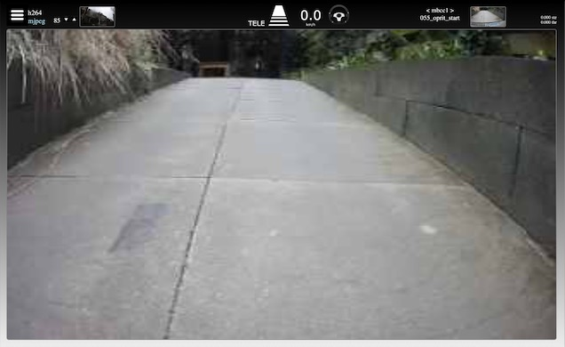

> On connection success the browser window should look like this (with a different view, perhaps).  
  In the top section of the screen you can see status information.

### Stop

Press the `east` button twice to stop the robot.

> 'East' is the rightmost button, red or with a red circle

### Teleoperation

Please use the triggers carefully, the robot may be more powerful than you expect.  
* Press the `east` button to go to teleoperation mode and start the engine
* The `left trigger` is used to go forward, the `right joystick` is used for steering.
* To go to reverse: First release all buttons, then press the `right trigger` and while holding it down, press the `down arrow` once.
* Drive backwards: go to reverse, release all buttons and triggers, then press the `right trigger`.

> The engine is turned off after a few minutes of inactivity, press `east` to turn it back on.  
> In forward mode the `right trigger` is used for active engine braking.

### Autopilot
* Press `north` to activate the autopilot 
* Press `up arrow` to allow the robot to start driving in autopilot
* Press `down arrow` to reduce the maximum speed or come to a stop

> Press `east` to go back to teleoperation mode

---

## Certificates
The W3C-community decide recently that Game-pads are only available within the secure-context(https)
There are no official certificates for private IP-no as used within the ZeroTier VPN's.
MWLC made self-signed certificates available via the webserver on the robot.
To use the certificate you have:  
- Get the certificate  
- Install and trust it

###Get the certificate
Assure your Robot is available in the ZeroTier network.
In th Mac-environment the following steps are taken:  
Click the HTTPS-lock-icon before the URL.

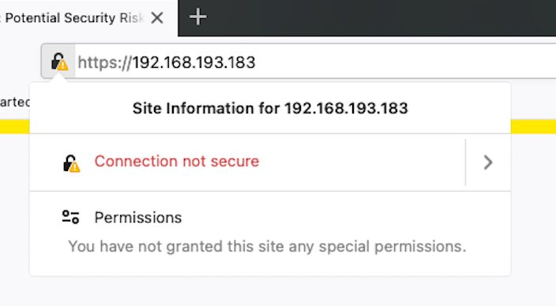

Click the details-arrow behind 'Information not secure'.  

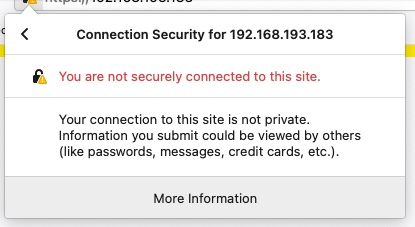

Click 'More information'.  

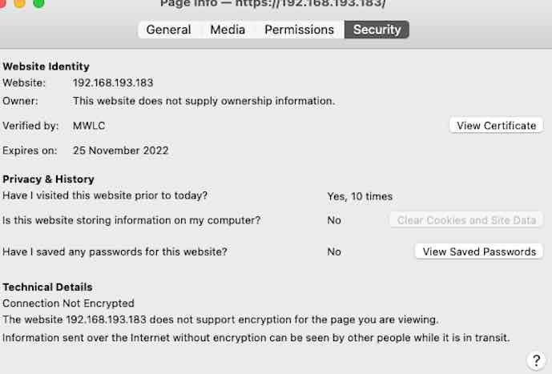  
  
    
Click 'View certificate' and scroll down.  

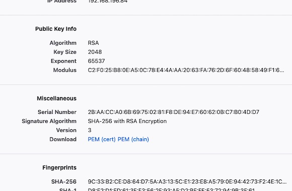  
  
   
Click 'PEM (cert)' to download the file and save it to your disk and remember the location.  

The certificate is now downloaded to your computer

###Install and trust the certificate

Go to the certificate and open it.  

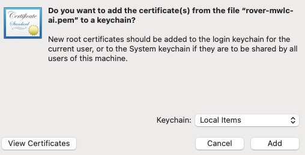  
  
The mac will ask to add the certificate to the computer for further usage.
Choose 'login' and click add.  
It's installed.

Go on with trusting it.  
Go to your key-chain and double-click the certificate.

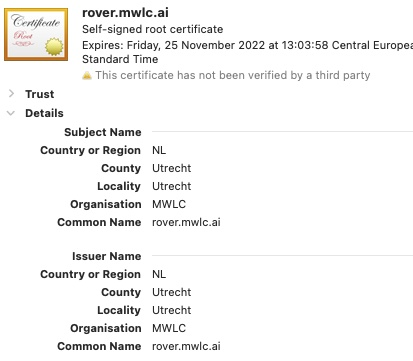  
  
  
Open the 'Trust'-section.

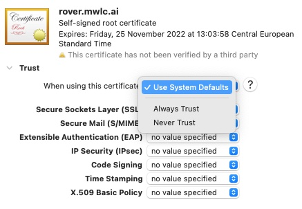  
  
Choose 'Always trust'.  
If requested, accept this with your password.  
  
  Go with Chrome to the robot and check is your controller works.

## Supported controllers
Chrome has been tested with recent xbox controllers, both wired and wireless, and recent wireless ps4 controllers.  
These type of controllers do more or less the same but use different button labels and graphics.

> Other browser/controller combinations may seem to work on first inspection - they get the 'standard' mapping in the html5 gamepad api -
> but be aware of unforeseen consequences due to ongoing developments in the api and browser stacks.

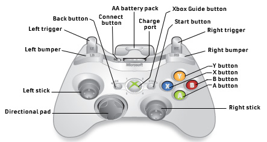
   
The controller has:
* Two joysticks on the top face: One on the left and one on the right
* Two groups of four buttons on the top face: In this manual we name them: `left-, right-, up-, and down-arrow`
  
  The buttons in the right group are named: `north, south, east and west`
* On the front of the controller there two buttons at each side. They are named `left button` and `right button`   
  The bottom triggers are called `left trigger` and `right trigger`

Control and acceleration values are sent from the controller via the computer to the robot.  
In addition the controller is used to send instructions to the autopilot.  
The controller has two modes, teleoperation and autopilot. 

## Stop and go to teleoperation mode
Press `east` twice:  
* if the controller or computer is in sleep mode; wake them up, go to teleoperation mode and stop
* if the robot's engine is in sleep mode, start it, don’t drive the robot
* if the robot is in autopilot mode; go to teleoperation mode and stop

> Warning: if connections are lost, the robot will not respond. If you have physical access to the robot, press the red button, use the key
> or simply move the robot aside by force.

## Options and status information on screen
### Teleoperation
#### Warnings

The screen has three warnings.  
1. Controller not detected. Try to press `east` to get it online.
1. Another user in control. This can be more difficult to solve; there might be another user in control or perhaps another 
   browser, window or tab on the same computer is connected.
1. Connection lost. This can have many reasons; please refer to the manual [Connections and ZeroTier](zerotier_manual.md) 
   which includes a section on problem solving.

#### Options

* Click the “hamburger” icon (leftmost) to:
  
    - Stop the data stream from the camera to your computer 
    - Go to the settings screen. To return to the main screen use the browser's ‘Back’ button.  
* h264: Stream from the camera based on system settings.
* mjpeg: Stream from the camera with manual compression control. Use the up- and down arrows to change the image quality in order to 
  minimize latency.

> These settings can be used for teleoperation and do not affect the autopilot.  
> In bad connection circumstances it can be necessary to manually set low image quality just to obtain acceptable latencies.

#### Input status

There are 4 instruction icons in use but the autopilot currently supports 'As learned' only.  
The others are `first left`, `first right` and `straight ahead`.

> 'TELE': Teleoperation mode with instruction 'As learned' activated.

Instructions 'First left', First right' and 'Straight ahead'.

Please note:
* In certain cases when another instruction is active, the autopilot may recognize the corridor and the steering wheel becomes grey. 
* 0.0 km/h: The speed value displayed is derived from throttle and not a reliable speed indicator.

> Currently only the ‘As learned’ instruction is in use.  
> If one of the others - ‘First right’, ‘First left’ or ‘Straight ahead’ - is visible, please turn it off using the corresponding button. 

#### Feedback

The steering wheel rotates on screen:    
* Indicating the current steering value from the controller
  
* When grey: The robot recognises its driving corridor but the robot reacts only on operator input as a result of teleoperation mode
* When red: The robot does not recognise its driving corridor  

> A grey steering wheel indicates the autopilot is ready to drive at the moment.

---

## Autopilot

### Warnings and options
See section teleoperation

### Input status

>  'AUTO': Autopilot mode with instruction 'As learned' activated.

Instruction icons: See Teleoperation but the effect differs:
* If the robot recognises its corridor the steering wheel is blue and the robot can drive itself as long as the max speed is set above zero.
* 10.0 max: The maximum speed as entered by the user with the controller `up` and `down` arrows.

### Feedback status

The steering wheel rotates on screen:    
* Indicating the current steering value from the autopilot
* When blue: The robot recognises its corridor
* When red: The robot does not recognise its corridor or there is more than one corridor
* 0.0 km/h: The speed value displayed is the maximum set value minus several autopilot estimates of the current driving situation

## Teleoperation mode

Teleoperation has two sub modes:
* Forward with braking or
* Backward with braking  

> There is no visual on screen indication of the sub mode.

### Button functions
* `East`

    - if the engine it not running, start it
    - if moving, stop 
* `Left trigger`  
    - when pressed and stopped or moving forward, accelerate until maximum power

    - when pressed and moving backwards, engine braking

    - when released and moving forwards, roll to stop
* `Right trigger`
    - When pressed and moving forwards, engine braking
    - When pressed and moving backwards, accelerate backwards until maximum power

    - When pressed in sub-mode forwards and not moving, nothing happens

    - When pressed in sub-mode backwards and not moving, accelerate backwards until maximum power
  
    - When released
and moving backwards, roll to a stop
    - When released and moving forwards, roll to a stop
* `Right trigger` in combination with `Down arrow`
    - When not moving, change to sub-mode backwards (reverse)
* `Right joystick`

    - move left/right, turn wheels

    - move up/down, not in use

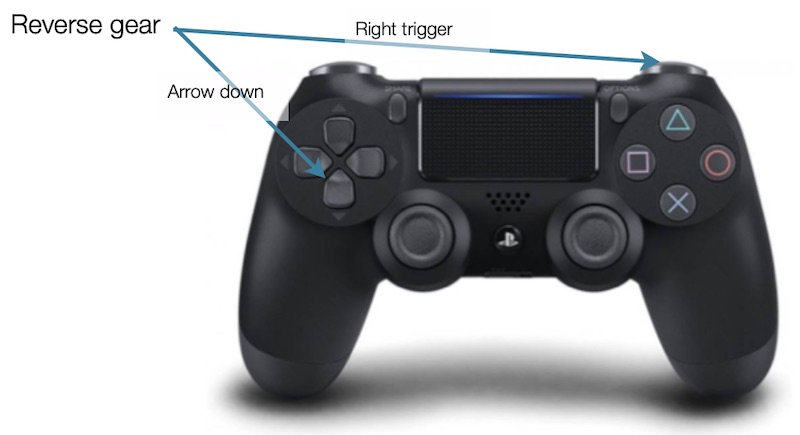

### Camera

The camera has a pan and tilt function which can be operated using the controller.

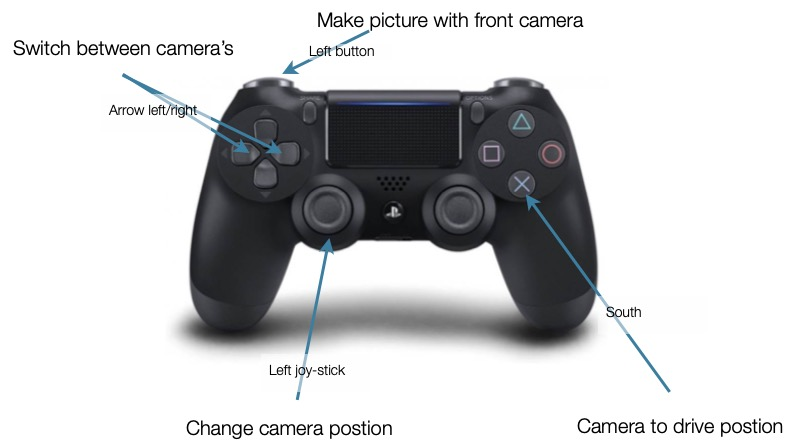

* `Left joystick`: Move to change the camera's pan and tilt positions
* `South`: Move the camera to its preset home position

## Autopilot mode
The robot can only drive if it recognises one, and only one, corridor.
 
If the robot can recognise one corridor then a maximum speed above zero is necessary to drive.
 
The autopilot chooses its speed based on the speed during training in combination with certainty of recognition of the
corridor and it never exceeds the maximum set speed.

### Interventions

The autopilot can be overridden by commands from the operator: 
* Increase or decrease speed
* Steering commands

> In autopilot mode it is not possible to drive backwards.

### Button Functions

#### Instructions

* `East`
    - wake up the controller and start the engine
    - switch to teleoperation mode

    - if the computer and/or controller are in standby, wake-up

    - in other situations, set the max speed to zero, go to teleoperation mode
* `North`. When in teleoperation, press to:
    - stop, set max speed to zero

    - switch autopilot on

    - show autopilot mode on screen

    - without instruction, the autopilot does what it was taught to do at that location 'As learned'
    - with instruction, show it on screen.
* `Arrow Up`. Press once briefly to:

    - increase the maximum speed by 0,2 km/h

    - show the max speed on screen   

    Press and hold:

    - the maximum speed increases by 0,2 km/h per 0,5 sec of pressing the button down

    - show the max speed on screen
* `Arrow Down`. Press once briefly to:
    - decrease the maximum speed by 0,2 km/h

    - Show the max speed on screen
   
    Press and hold to

    - decrease the maximum speed by 0,2 km/h per 0,5 sec of pressing the button down 
    - show the max speed on screen
* `Left button`. When the current instruction is not ‘Next left’, press to:

    - activate instruction ‘Next left’

    - show the instruction on screen (road icon with left arrow)
  
    When the current instruction is ‘Next left’:
    - activate instruction ‘As learned’
and show it on screen (road icon)
* `Right button` 

    Likewise for 'Next right'.
* `Home button`   
    Likewise for 'Next ahead'.

> Note that the autopilot currently supports the 'As learned' instruction and not the others.

#### Operator interventions overrule the autopilot 

* `Left trigger` 
    - increase speed up to the set autopilot max speed   
    - record images, instructions and values including but not limited to steering and throttle, for training purposes   
    Release to:

    - leave the speed for the autopilot to determine
and stop recording
* `Right trigger`
    - decrease speed or stop

    - record images, instructions and values including but not limited to steering and throttle, for training purposes   
    Release to:

    - leave the speed for the autopilot to determine and stop recording
* `Right joystick`

    - steer
    - record images, instructions and values including but not limited to steering and throttle, for training purposes   
    - up/down movements are ignored

