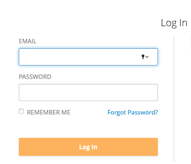
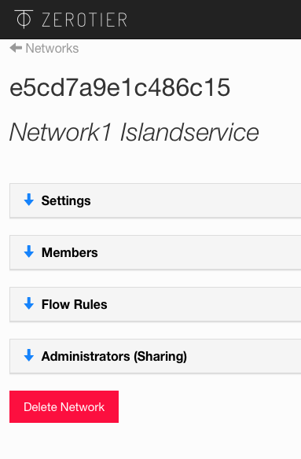
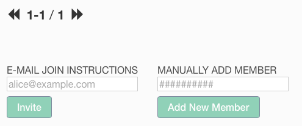
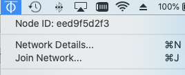
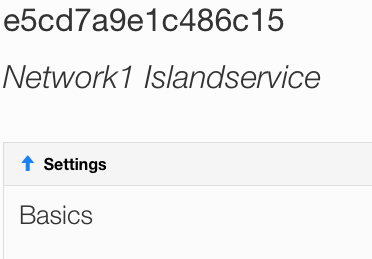
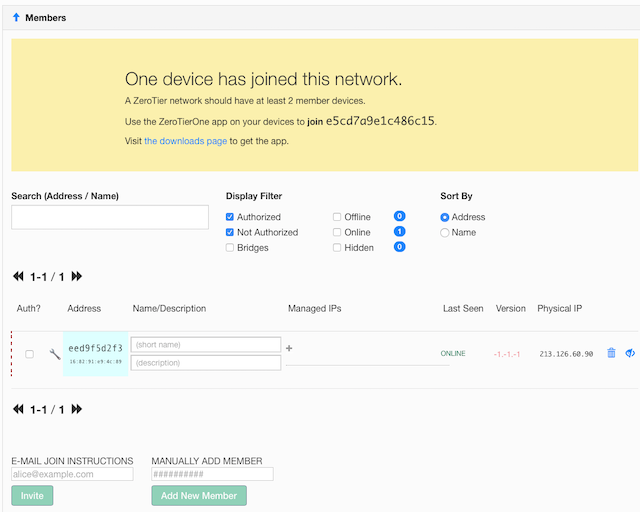

# ZeroTier

## Introduction
The robots from MWLC can be managed and/or operated via internet. 
Although the main purpose of the robot is driving autonomously, the robot is heavily dependant on the internet connection with the operator.

* The operator sends instructions to the robot.  
* The robot sends status information and a video stream in return.  
* Outside the operational window there are data exchanges and updates.  
  
The connection should be reliable, have enough bandwidth, as little delay as possible and must be secure. 
Especially the video stream increases connection demands. Enough bandwidth is necessary and the delay must be minimal.

It is important that non-authorised parties are excluded from accessing the robot.  
On the internet, connections hop via a great number of different parties. 
The services of the different providers must be coordinated and in addition, there are constantly changing circumstances and requirements.  
The robot runs webservices that can be accessed via a browser. To ensure security, the robot is only accessible via a 
Virtual Private Network (VPN) from ZeroTier.
  
The operators have access to the robot via a ZeroTier VPN that is setup in advance for one or more robots that are managed by the 
VPN-manager.
MWLC creates a ZeroTier-VPN with the robot as a node. The information to manage the VPN is available to the VPN-manager.  

## Connections of the robot
The robot has three types of methods to connect to the internet:  

* Wireless mobile such as 4g, 5g, LTE  
* WiFi  
* Ethernet   

The connections are managed by the RUT955 router.  
See [teltonika-networks.com/product/rut955](https://teltonika-networks.com/product/rut955).  

The default connection is configured to use the WAN-port. The WAN-port of the router is connected to the WAN-connector at the back of 
the robot. 
This ethernet connection is very useful for software updates and data exchanges.  
If the WAN-port isn’t used the router will connect via 4g. The WiFi-connections are not in use as they are not very reliable in the field 
in combination with ZeroTier.  
Beside this there is a LAN-connection that creates the possibility to troubleshoot the robot.  

## ZeroTier
ZeroTier is an open source peer-to-peer VPN, without a central server. The usage of ZeroTier is well described in its documentation.  
A VPN from ZeroTier is a network between devices, called nodes. Nodes can be robots or end-user computers. A computer node can have 
different users, this is not noticed by the VPN. It is the task of the VPN-manager to decide which nodes are granted access.  
A ZeroTier VPN has an administrator, the VPN-manager.  
Networks are configured with the following parties:  

* A VPN-manager using the ZeroTier website
* One or more robots. One robot can have more nodes on board that all use the VPN.
* Zero or more end-user computers or operators.  
    
> If the VPN-manager decides to operate a robot, he or she has to use a computer which is part of the network.
> When a VPN-manager is responsible for multiple robots, all of them can be made accessible using the same network.  

### Procedure

MWLC creates a ZeroTier-account with an MWLC-email account and initiates a network.  
Cloud-management of MWLC adds robots to this network.  
The VPN-manager is responsible for the computers in the network. If a computer has acces to the network, any user of the computer could 
in principal operate the robot. It is important not to have more computers in the network than strictly necessary.  
MWLC sets up the ZeroTier network and adds the robots as nodes. The information is handed over to a VPN-manager to add computers, 
as nodes, for the operators.
 
In the credentials document you will find the information to take over management of your network. 
You could, naturally, also setup your own ZeroTier networks.  
Most necessary functions are describe in this document but please be aware of any changes by ZeroTier itself.  

## ZeroTier Hub 

### Log in

Go to [my.zerotier.com/login](https://my.zerotier.com/login)

`Click the button to proceed`

`Email: see credentials`   
`Password: See credentials`  
`Click ‘Log In’`

 

`Click ‘Networks’`

`Choose the network from your credentials.`  
`If it isn’t available or you see other networks, contact MWLC.`  

`You will see the Network screen. This screen has four sections.`  
`Sections can be closed using the blue arrows.`  
`Please open the ‘Members’ section.`

## Add a computer
Adding computers is done in three steps.  
1. The VPN-manager invites the computer-owner to install the ZeroTier-client and send back the nodeID.
 
    Optionally the VPN-manger can also send the NetworkID.
1. The computer owner:  
    * installs the ZeroTier-client on the computer
 
    * instructs the application to access to the network and
 
    * sends the VPN-manager the node ID as mentioned in the application      
1. The VPN-manager authorises the computer.  

### Ad 1. The invitation
There are no special requirements to the invitation. At the bottom of the 'members' section there is a little tool. 
By just filling in the email-address the proposed candidate gets all necessary information.  

`If the VPN-manager already knows the nodeID, its possible to use ‘MANUALLY ADD MEMBER’ 
and add the node directly to the network.`

### Ad 2. Create a new Node
To add a computer to the network, the computer has to run the ZeroTier-client.  
Install the application from ZeroTier: [www.zerotier.com/download](https://www.zerotier.com/download)

`Your computer gets a ‘Node ID’`  
`In the client choose ‘Join network’`  

`Use the networkID received from the VPN-manager`  
`Click ‘Join’`

The network will appear in the list on the computer but before having access the VPN-manager must authorise it.  
Inform the VPN-manager of your nodeID so he or she can check if it appears in the network. This can take minutes, up to hours, depending 
on the complexity of the internet routes between your node and the other nodes.  
Keep in mind that changing your IP number on the internet wil be seen as a trigger to recalculate the managed routes.  

### Ad 3. Authorisation of the computer by the VPN-manager
The moment the computer has joined the network it can be authorised.  
This authorisation has to be done by the VPN-manager

Log in into ZeroTier and go to the network via the ‘Networks’ option in the top menu and click on the correct networkID.  
The network-management screen appears.

`Close the ‘Settings’ by clicking the blue arrow.`

The ‘Members’ section for managing network nodes appears.

`Check if you recognise the nodeID in the column ‘Address’.`  
`If this is a familiar node you can authorise it in the column ‘Auth?’.`    
`After authorisation the node will get a managed IP.`  

### Robots in the network
In this overview you also see the robots in your network. MWLC is responsible for making a robot accessible in the correct network.

#### Managed / physical ip's

The VPN client makes the computers and robots part of a closed, virtual IP-network. All nodes have two types of IP:
  
* One to connect the computer to the internet.
 
    The physical connection to the internet. E.g. the 4g-router from the robot gets is IPno from the SIM-card.
 
    If the computer changes its physical internet connection, such as switching from 4g to a Lan then this number is changed.
 
    At that moment the ZeroTier connections will be restructured to find the most efficient route. 
    During this restructuring the computer won’t be connected to the VPN. This can take some time. 
* One to connect the computer to the virtual private network, the managed IPno. 

    This number can be changed by the user but does not affect the connection time. 

#### Automatic optimisation of the VPN
The ZeroTier infrastructure calculates the most optimal route between the nodes of the network. This is necessary to avoid delay in the 
video-stream. If somewhere in the route changes are made a recalculation can be triggered.  
If a computer is connected to the ZeroTier VPN a request will be first resolved in the VPN before going outside to the internet.

---

### Connection issues

#### Primary checks
* On the client, is there another VPN running?
* On the client, are there any other browsers or Tabs running with a connection to the Robot?
* On the client, does the application use the correct network ID?
* On the client, does the client have internet access?
* On the ZeroTier network members section, does the client appear in the network as ‘ONLINE'?
* On the ZeroTier network members section, is the client authorised?

#### Changing ip / computer wake up / network isp switch
If a node changes its physical connection, 4g,cable or WiFi, it can take several minutes to recalculate the routes.  
When a computer wakes up from its sleep mode this could trigger a recalculation of the network.  
Some more advanced routers can switch isp to improve speed or provide for failover scenario’s. In case of a ZeroTier network this can be 
contra-productive. Most of the time this also means changing the IPno and therefor recalculation of the routes.  

On the client, in order to improve the connection set-up speed it might help to initiate this manually.  
On a Mac open a terminal and issue:

    sudo launchctl unload /Library/LaunchDaemons/com.zerotier.one.plist &&\
    sudo launchctl load /Library/LaunchDaemons/com.zerotier.one.plist

#### Changing the MTU
In certain cases the network interface maximum transmission unit (MTU) may be too large.  
You can inspect the mtu of an interface in the terminal with:  
    
    ifconfig
    
Set the mtu using the network interface name.

    sudo ifconfig <interface> mtu 1200
    
>This change is temporary and does not survive restarts.  
>Please refer to your operating system to make the change permanent, if possible.